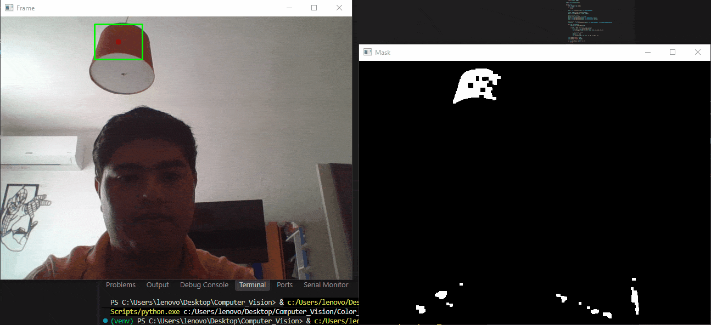

# Real-Time Color Detection with OpenCV

Real-time color detection and tracking pipeline built with Python and OpenCV. The system identifies a target color from the webcam feed, isolates it, filters out noise, and highlights the detected object with a bounding box and center point.



## How it works

1. **Color space conversion** — each frame is converted from BGR to HSV, since HSV separates color (hue) from lighting/brightness, making detection more robust to lighting changes.
2. **Masking** — pixels within the target HSV range (e.g. blue) are isolated into a binary mask.
3. **Morphological operations** — erosion/dilation is applied to the mask to reduce noise and close small gaps.
4. **Contour detection** — `cv2.findContours` identifies connected regions in the cleaned mask.
5. **Minimum area filtering** — contours below a minimum area threshold are discarded to ignore small false positives.
6. **Bounding box + center** — the largest valid contour is highlighted with a green bounding box, and its centroid is marked with a red point.

The pipeline runs across three live windows: the raw camera feed with the detection overlay, the binary mask, and the final result.

## HSV calibration tool

Since HSV ranges vary by lighting condition and object color, this repo includes a small calibration utility (`hsv_calibration.py`): click on any pixel in the camera feed and the HSV value at that point is printed to the console, so you can quickly find the right lower/upper bounds for `color_detection.py`.

## Project structure

```
├── hsv_calibration.py    # click-to-read HSV values for calibration
├── color_detection.py    # main detection pipeline
├── requirements.txt
└── Demo.gif
```

## Requirements

```bash
pip install -r requirements.txt
```

- Python 3.9+
- OpenCV (`opencv-python`)
- NumPy
- A webcam

## Usage

1. (Optional) Run the calibration tool first to find the HSV range for your target color/lighting:
   ```bash
   python hsv_calibration.py
   ```
2. Update the HSV lower/upper bounds in `color_detection.py` with the values you found.
3. Run the main detector:
   ```bash
   python color_detection.py
   ```
4. Press `Escape key` to exit.

## Notes

This is a classical computer vision approach (no deep learning) — it relies on color segmentation rather than a trained model, which makes it fast and lightweight but sensitive to lighting conditions and to other objects sharing the target color in frame.

## Author

Antonio — Graduate in Robotics & Digital Systems Engineering, UNITEC Querétaro. Working toward computer vision / ADAS roles.
